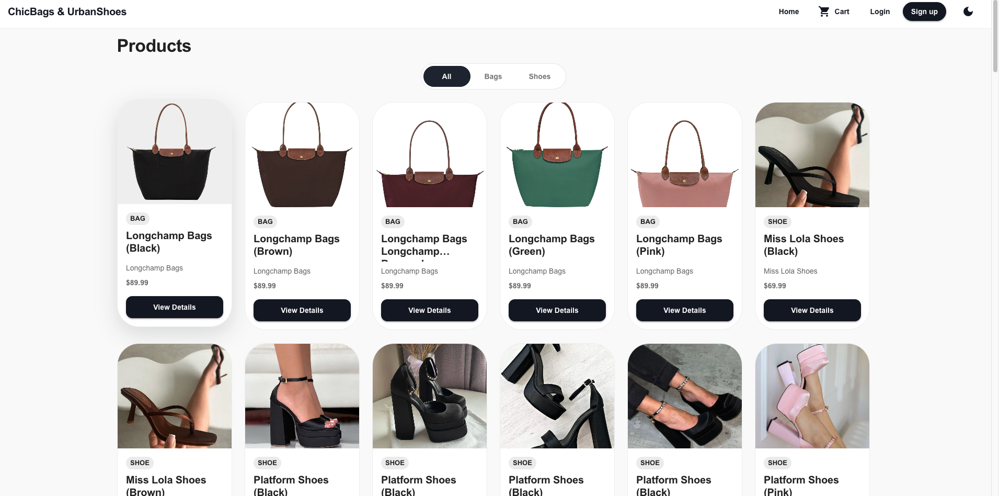
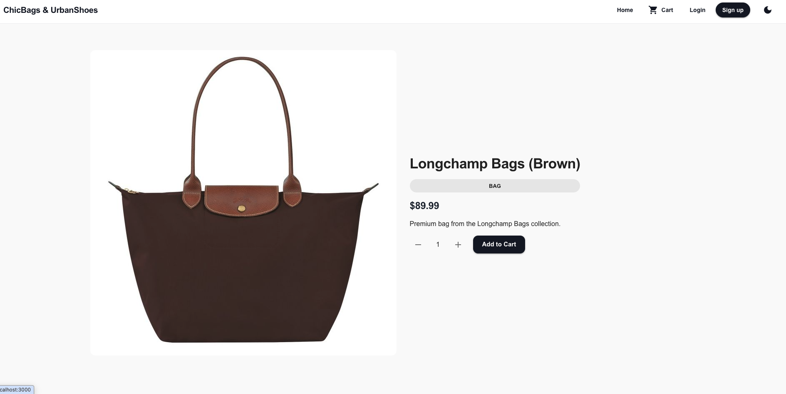
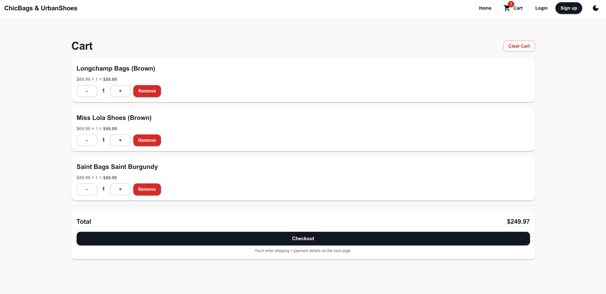
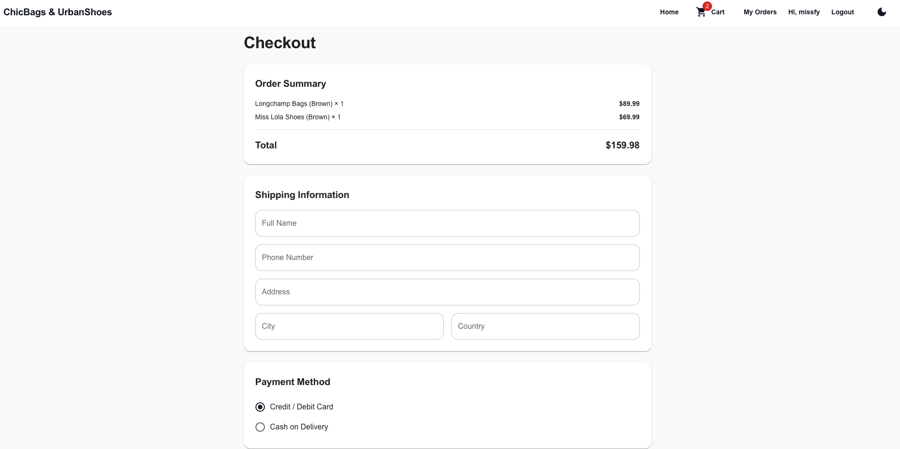
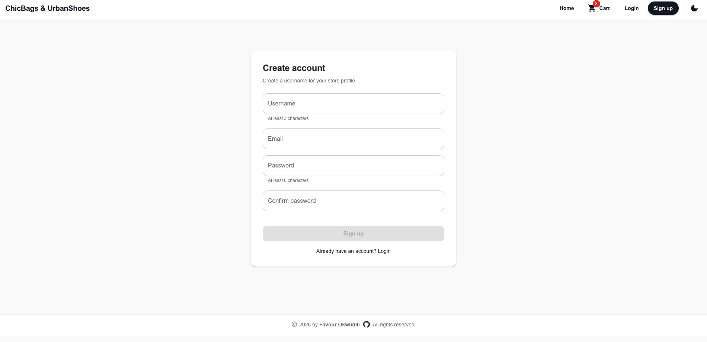
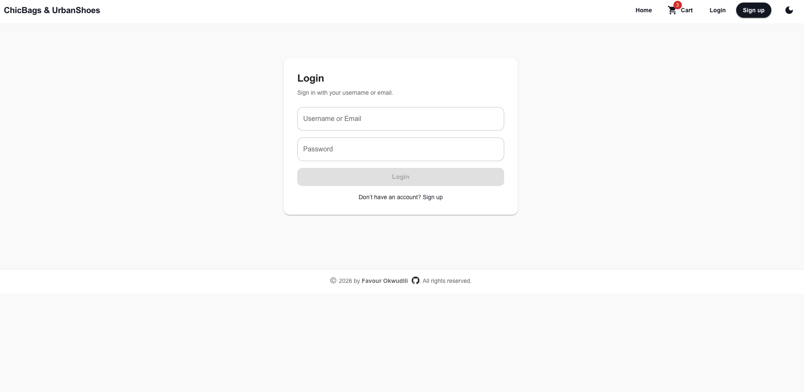
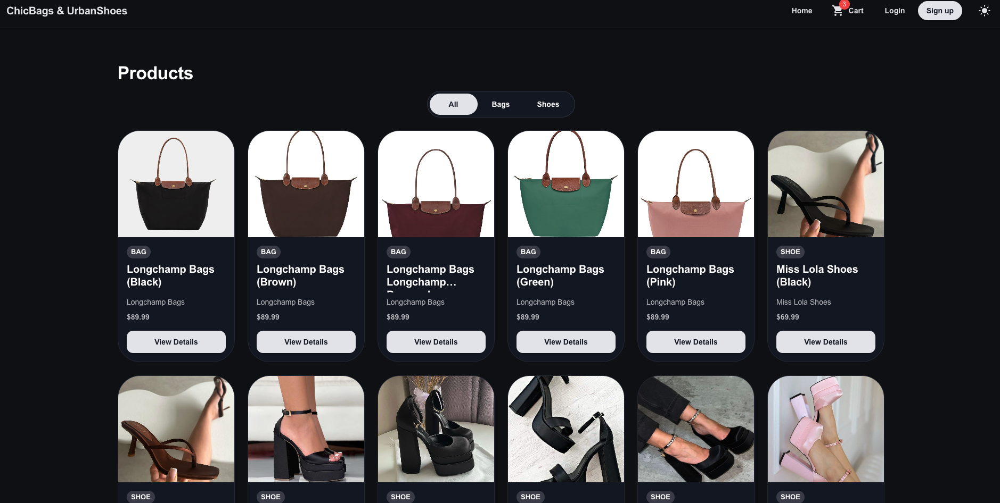
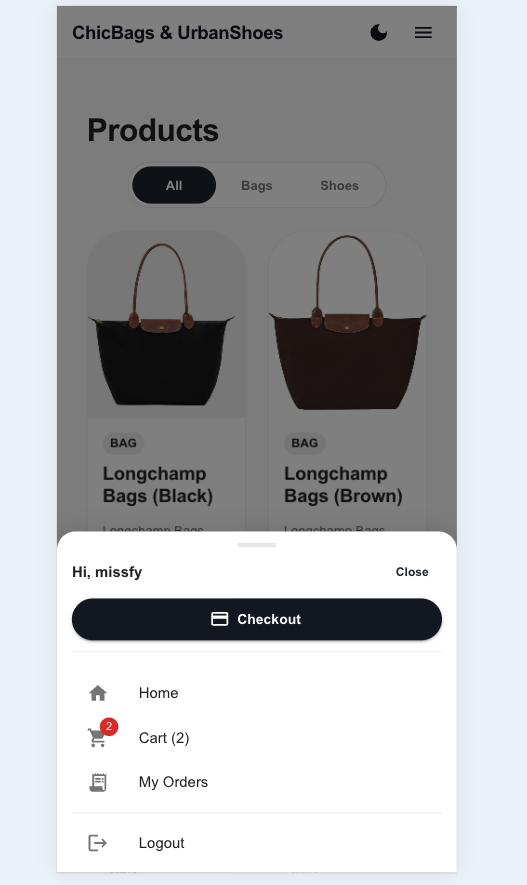
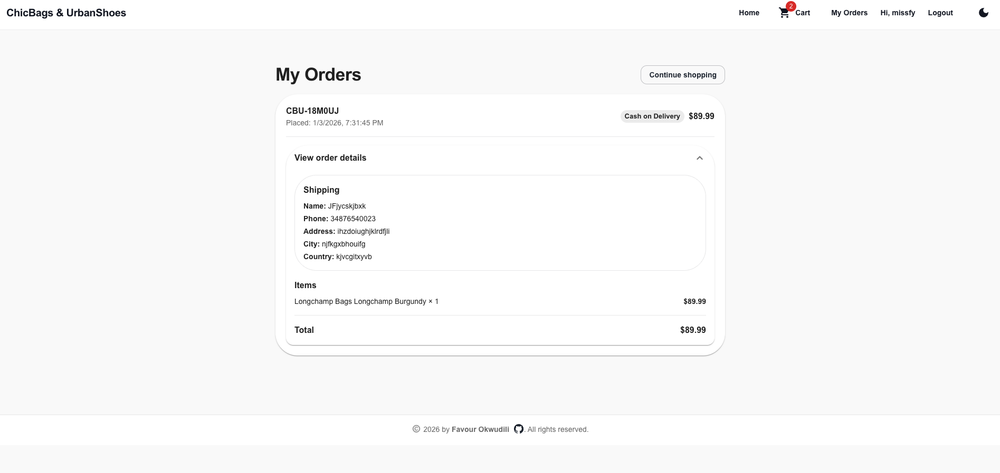

# ChicBags & UrbanShoes 👜👟

ChicBags & UrbanShoes is a full-stack e-commerce web application developed as part of a university web application development project. The application represents an online fashion store specializing in bags and shoes and demonstrates the use of modern web technologies, RESTful APIs, SQL databases, and responsive user interface design.

---

## Project Overview

The system follows a client–server architecture where the backend provides RESTful services for product data, and the frontend consumes these services to render dynamic content. Users can browse products, view product details, filter by category, and manage a simple client-side shopping cart.

---

## Screenshots

### Home – Product Grid

### Product Details

### Cart Page

### Checkout

### Sign Up

### Log In

### Dark Mode

### Mobile View

### Orders Page


---


## Technologies Used

### Backend
- Spring Boot – Backend framework for RESTful API development  
- Spring Web – Handles HTTP requests and responses  
- Spring Data JPA – Manages database access and object–relational mapping  
- PostgreSQL – SQL database used for persistent data storage  
- Validation – Ensures data integrity and reliability  
- Lombok – Reduces boilerplate code  
- Maven – Dependency and build management  

### Frontend
- React – JavaScript framework for building user interfaces  
- Material UI – Component library for responsive design  
- Axios – Handles HTTP communication with the backend  
- React Router – Manages routing and navigation  

---

## Features

- Product listing for bags and shoes  
- Category-based product filtering  
- Product details page  
- Client-side shopping cart (React Context)  
- RESTful API integration  
- Responsive UI using Material UI  
- SQL-based data storage  
- GitHub version control  

---

## Project Structure

```
SourceCode/
├── frontend/        # React + Material UI frontend
├── backend/         # Spring Boot backend
└── database/        # CSV and SQL database scripts
```

---

## How to Run the Project

### Backend
```bash
cd SourceCode/backend
./mvnw spring-boot:run
```

Backend runs at:
```
http://localhost:8080
```

---

### Frontend
```bash
cd SourceCode/frontend
npm install
npm start
```

Frontend runs at:
```
http://localhost:3000
```

---

## Database Setup

The database folder contains:
- products.csv – Exported product data  
- products_postgres.sql – SQL script to create and populate the products table in PostgreSQL  

Located in:
```
SourceCode/database/
```

---

## Feature Compliance Table

| Feature | Implemented |
|------|-------------|
| Spring Boot Backend | Yes |
| SQL Database Usage | Yes |
| RESTful API | Yes |
| React Frontend | Yes |
| Material UI Design | Yes |
| Product Listing | Yes |
| Product Filtering | Yes |
| Product Details Design | Yes |
| Client-Side Shopping Cart | Yes |
| GitHub Version Control | Yes |

---

## Learning Outcomes

This project strengthened my understanding of full-stack web development, including RESTful API design, SQL database integration, frontend–backend communication, and responsive UI development using modern frameworks and libraries.

---

## Author

Favour Okwudili  
Computer Engineering Student  

---

## License

This project is developed for educational purposes.


